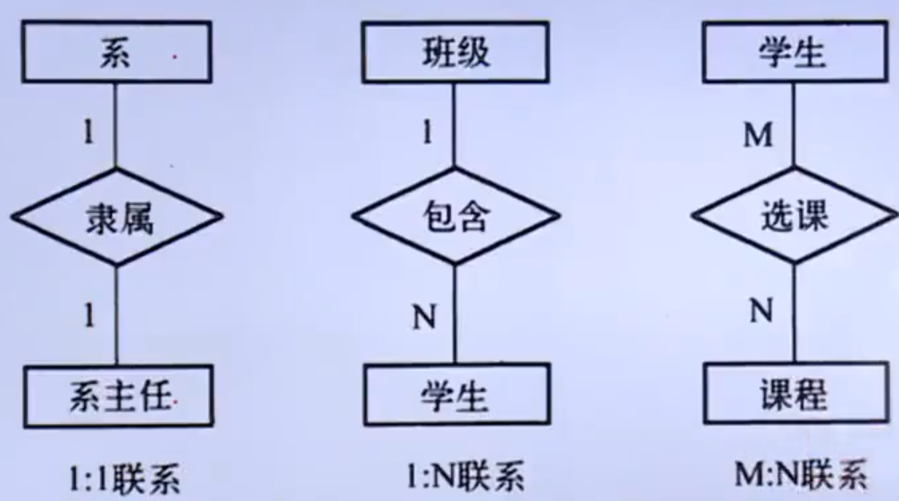

# 数据库系统原理

# 第一章 数据库系统概述

## 1.1 数据库基本概念

- **数据**：是 **描述事物的符号记录**，是指用物理符号记录下来，可以鉴别的信息

- **数据库：**是 **长期存储在计算机内的有组织的，可共享的大量数据集合**

  - 数据库存储的数据特点：**长期存储的、有组织的、可共享的**

- 数据库管理系统(DBMS)：是位于 **用户与操作系统** 之间的一层 **数据库管理软件**

  - 主要功能

    1. **数据定义功能**：提供数据定义语言(DDL)，定义数据库中的数据对象

       例如：表、视图、存储过程、触发器等

    2. **数据操作功能**：提供数据操作语言(DML)，操作数据实现对数据库的基本操作

       例如：增删查改

    3. **数据库的运行管理：**保证数据的安全性，完整性、高并发、以及故障修复

    4. **数据库的建立和维护功能**

    5. **数据组织、存储和管理功能**

    6. **其他功能**：网络通信；不同数据库管理系统之间的相互传输

- 数据库系统(DBS)：指在计算机中引入数据库技术之后的系统

  - 通常一个完整的数据库系统应该包括 **数据库数据库管理系统及相关使用工具、应用程序，数据库管理员和用户**
  - 数据库管理员(DBA)：专门对数据库进行维护，并保证数据库正常，高效运行

## 1.2 数据管理技术的发展

1. 人工管理阶段
   - 特点
     1. **数据不保存**
     2. **应用程序管理数据**
     3. **数据面向应用**
   - 总结：**记录内无结构，整体无结构**
2. 文件系统阶段
   - 特点
     1. 数据的管理者：文件系统，**数据可长期保存**
     2. 数据面向的对象：某一应用程序
     3. 数据的共享程度：**共享性差，冗余度大**
     4. 数据的结构化：**记录内有结构，整体无结构**
     5. 数据的独立性：**独立性差**，数据的逻辑结构改变必须修改应用程序
     6. 数据控制能力：应用程序自己控制
3. 数据库系统阶段
   - 特点
     1. 数据集成
     2. 数据独立性高(数据和应用是分开的)
     3. 数据共享性高
     4. 数据冗余度小
     5. 数据一致性
     6. 实施统一的管理和控制
     7. 减少应用程序的开发和维护的工作量

## 1.3 数据库系统的结构

- 数据库系统的三级模式结构

  1. **模式**：

     也称为 **概念模式或逻辑模式**，它是数据库中全体数据的逻辑结构和特征的描述，是所有用户的公共数据视图

  2. **外模式**：

     也称为 **子模式或用户模式**，数据库用户(包括应用程序员和最终用户)能够看见和使用的局部数据的逻辑结构和特征的描述

     DBMS 提供子模式描述语言 (DDL) 来严格定义子模式 

  3. **内模式**

     也称为 **存储模式**，它是对数据库中数据的物理结构和存储方式的描述，是数据在数据库内部的表现形式

     DBMS 提供

  4. 三级模式结构的两层映像和数据独立性(逻辑 and 物理)

     1. 外模式/模式映像 - 逻辑独立性
     2. 模式/内模式映像 - 物理独立性

- 数据库系统的运行与应用结构

  1. B/S
  2. C/S

## 1.4 数据模型

- 数据特征与**数据模型组成要素**

  1. 数据特征

     - 静态：包括**数据的基本结构、数据间的联系以及对数据取值范围的约束**
     - 动态：**对数据可以进行符合一定规则的操作**

  2. 数据模型组成要素

     - **数据结构**

       数据结构描述的是系统的 **静态特性**，即数据对象的数据类型、内容、属性以及数据对象之间的联系

     - **数据操作**

       数据操作描述的是系统的 **动态特性**，是对各种数据对象的实例允许执行的操作的集合，包括操作及有关操作规则

     - **数据约束**

       用来保证数据的正确性、有效性、相容性

- 数据模型的分类

  1. **概念层模型数据**

     1. 信息世界中的基本概念

        - 实体：客观存在并可相互区别的事物
        - 属性：实体所具有的某一特性称为属性
        - 码：唯一标识实体的属性集称为码
        - 域：属性的取值范围称为该属性的域
        - 实体型：实体 Type
        - 实体集：实体 Set
        - 联系
          - 一对多
          - 一对一
          - 多对多

     2. **概念模型的表示方法**

        - 概念模型：用来描述现实世界的事物之间的关系，与计算机系统无关

        - 最典型的概念模型是 **实体联系(E-R)**

          

  2. 逻辑层数据模型

     1. 层次模型
     2. 网状模型
     3. **关系模型**
     4. 面向对象模型

  3. 物理层数据模型

     也称为数据的物理模型，是逻辑模型的物理实现，即每一种逻辑模型在实现时都有与之相对应的物理模型

# 第二章 关系数据库

## 2.1 (了解即可)概述


关系数据库应用 **数学方法** 来处理数据库中的数据

## 2.2 关系数据模型

### 1) 关系数据结构

> 关系模型的数据结构就是单一的数据结构，即关系(也就是二维表)

- 基本术语

  1. 表

     也称关系，是一个二维的数据结构，有表名、构成表的各个列、若干行数据组成

     每个表都有一个唯一的表名，表中的每一行数据描述一条具体的记录值

  2. 关系

     一个关系对应一张二维表(逻辑上)；可以为每个关系取一个名称进行表示(逻辑上就是表名)

  3. 列

     也称为字段、属性；表中的每一列都有一个名称，称为列名、字段名。属性名

     每一列表示实体一个属性，具有相同的数据类型

  4. 属性

     表示的一列即使一个属性。表中属性的个数称为关系的元/度；属性值的取值范围就是值域

  5. 行

     也称为记录、元组

  6. 元组

     表中的一行

  7. 分量

     元组中的一个属性值，称为分量

  8. 码

     在一个关系中，可以唯一标识任意一个元组，称为该关系的码/键

  9. 超码/超键

     当某一个关系中的一个码移除了某个属性的话，它仍然是这个关系的码。就称为超码/超键

  10. 候选码/候选键

      当某一个关系中的一个码移除了某个属性的话，就不再是这个关系的码，就称为候选码/候选键

  11. 主码/主键

      在一个关系的若干个候选码或候选键中指定一个用来唯一标识关系的元组

      则称这个被指定的候选码或候选键为该关系的主码或主键

  12. 全码/全键

      一个关系模型的所有属性是这个关系的主码/主键，则称这样的主码/主键为全码/全键

  13. 主属性和非主属性

      关系中包含任何一个候选码的属性称为主属性，不包含任何一个候选码的属性称为非主属性

  14. 外码/外键

      当关系中的某个属性不是这个关系的主码/候选码，而是另一关系的主码时，称该属性(/属性组)为这个关系的外键/外码

  15. 参照关系和被参照关系

      参照关系又称为从关系，被参照关系又称为主关系，它们是以外码相关联的两个关系

      以外码为主码的关系称为参照关系，外码所在的关系称为被参照关系

  16. 域

      属性的取值范围

  17. 数据类型

      每一个列都有一个相应的数据类型，用来约束数据

  18. 关系模型

      每一个关系与对应的字段(属性、列)

  19. 关系数据库

      以关系模型作为数据的逻辑模型，

      并采用关系作为数据组织方式的一类数据库，

      其数据库操作建立在关系代数的基础上

### 2) 关系操作集合

#### 一、基本的关系操作

1. 查询
2. 数据更新
3. 关系操作的**特点：**集合操作方式，即操作的对象和结果都是集合

#### 二、关系数据语言的分类 

- 关系操作的能力可以用两种方式来表示：**代数方式**和**逻辑方式**

  - 代数方式主要有关系代数，通过**对关系的操作**来表达查询要求的方式

    包括：集合运算符、专门的关系运算符、比较运算符、逻辑运算符

  - 逻辑方式主要有关系演算，它使用**谓词**来表达查询要求的方式

- 具有关系代数和关系演算双重特点的语言：**SQL**

#### 三、关系代数

1. 传统的集合运算

   > 并、差、交、广义笛卡尔积

   - 并：将两个表的所有记录合并为一个集合
   - 交：将两个表中相同的记录合并为一个集合
   - 差：将一个表中的记录减去另一个表中的记录，得到一个集合
   - 笛卡尔积：(两个表的结构可能不相同)用一个表中的所有记录分别匹配另一个表中的所有记录

2. 专门的关系运算

   > 选择、投影、连接、除

   - 选择

     语法：`SELECT 关系名 WHERE 条件`

     其中条件是由常数、属性名或列名、比较操作符和逻辑运算符组成的条件表达式

     

   - 投影：保留指定列的所有记录

   - 连接：

     语法：`JOIN 关系名1 AND 关系名2 WHERE 条件`

   - 除：连接的逆运算

### 3) 关系的完整性约束

1. 实体完整性约束

   指关系的主属性，即主码的组成不能为空(不能是空值 NULL)

2. 参照完整性约束

3. 用户定义完整性约束

4. 关系模型完整性约束的检验

   - 执行插入数据
   - 执行删除操作
   - 执行更新操作

## 2.3 关系数据的规范化理论

### 1) 关系模式中可能存在的冗余和异常问题

1. 数据冗余
2. 更新异常
3. 插入异常
4. 删除异常


# 第三章 数据库设计

## 3.1 数据库设计概念

### 一、数据库的生命周期

#### 1) 数据库分析与设计阶段

1. 需求分析
2. 概念设计
3. 逻辑设计
4. 物理设计

#### 2) 数据库实现与操作阶段

1. 数据库的实现
2. 数据库的操作与监督
3. 数据库修改与调整

### 二、数据库设计的目标

> 满足应用功能需求 & 良好的数据库性能

### 三、数据库设计的内容

> 数据库结构设计 & 数据库行为设计

### 四、数据库设计的方法

1. 直观设计法
2. 规范设计法
   1. 新奥尔良设计方法
   2. 基于 E-R 模型的数据库设计方法
   3. 基于第三范式的设计方法
3. 计算机辅助设计法
   - 使用·`NML 类图` 完成对需求的关系设计，再通过相应的工具生成对应的数据库
   - 使用工具：Rose、Visio

### 五、数据库设计的过程

1. **需求分析**(最重要)
2. 结构设计 & 行为设计
3. 数据库实施
4. 数据库运行与维护

## 3.2 数据库设计基本步骤

### 一、需求分析

1. 确定数据库范围：确定数据库应该**支持哪些应用功能**

2. 应用过程分析：

   了解并分析数据与数据间的关系之后，数据库设计人员应逐次的**了解并分析每一 部门/功能 要使用的数据、**

   **数据使用的顺序、对数据作何处理和处理的策略以及处理的结果等**

3. 收集和分析数据

   - 静态结构：指不对数据施加任何的应用操作的原始状况，可以通过 **数据分类表和数据元素表** 进行说明
   - 动态结构：指将应用操作施加在数据之上后数据的状况，可以通过 **任务分类表和数据操作特征表** 进行说明
   - 数据约束：指使用数据时的特殊要求

4. 编写需求分析报告

   1. 数据库的应用功能目标(功能/性能)
   2. 标明不同用户视图范围
   3. 应用处理过程需求说明
   4. 数据字典：对于某些偏专业的数据，需要先定义相应的标签，标签中有对该数据的详细说明(类型、作用方法，作用等)
   5. 数据量
   6. 数据约束

### 二、概念结构设计

- 在需求分析中产生的**需求分析报告的基础上**，按照特定的方法设计满足应用需求的**用户信息结构**
- 该信息结构成为 **概念模型**
- 其中采用 **E-R图** 作为概念模型的描述工具

### 三、逻辑结构设计


### 四、物理设计

- 对于一个数据库逻辑结构，研究并构造物理结构的**过程**
- 具体任务是确定数据库在存储设备上的存储结构及存取方法，可能会应 DBMS 的不同而不同(建立索引和聚集，物理块大小等)

### 五。数据库实施

1. 加载数据(测试数据的正确性等)
2. 应该程序设计(程序开发)
3. 数据库试运行(调试)

### 六、数据库运行和维护

- 经过试运行之后，确认系统无故障或暂未发现故障时，系统才能投入到生产实际中运行
- 数据库系统的投入实际运行标志着 **数据库设计和应用开发的基本完成**，但不意味着设计和应用开发工作的终止
- 系统维护中**最困难**的工作室**数据库重组与重构**

## 3.3 关系数据库设计方法

### 一、关系数据库设计过程与各级模式


### 二、概念结构设计方法

#### 1) E-R 图

1. 三种关系：一对一、一对多、多对多

   

2. 两个以上的实体型之间的联系

   

   **多个实体的主键还需要在一张额外的表中作为外键存在**

3. 单个实体型内的联系

   

   可以在对应的表中的最后一列设置**标识符**属性

4. E-R 图中的主键下面加上单个下划线，外键的下面加上两个下划线

#### 2) 局部信息结构设计

1. 确定局部范围
2. 选择实体
3. 选择实体的关键字属性
4. 确定实体间的联系
5. 确定实体的属性

#### 3) 全局信息结构设计

1. 属性冲突
2. 命名冲突(在属性前面加上'表名_')
3. 结构冲突

### 三、逻辑结构设计方法

1. E-R 图向关系模型的转换(将 E-R 图表示的实体转换成 `实体名(属性1...)` 的格式)
2. 数据模型的优化(例如多对多的关系，我们可以多建议一张表将其转换成两个一对多的关系)
3. 设计用户子模式(视图)

### 四、物理设计方法

1. 建立索引
2. 建立聚集

# 第四章 SQL 与关系数据库基本操作

## 4.1 SQL 概述

### 一、SQL 的发展

- 结构化查询语言：介于**关系代数**和**关系演算**之间的语言
- 具有**语言简洁，方便使用，功能齐全**等优点
- SQL 语言最终发展成为**关系数据库的标准语言**和**数据库领域中一个主流语言**，SQL 被 ANSI 确定**数据库系统的工业标准**
- **SQL 语言不区分大小写**

### 二、SQL 的特点

1. 广泛性高，基础所有的关系数据库都支持 SQL 语言
2. 简单易学
3. 强大且灵活

### 三、SQL 的组成

1. 数据定义语言
2. 数据操作语言
3. 数据控制语言
4. 嵌入式和动态 SQL 规则
5. SQL 调用和会话规则

## 4.2 MySQL 预备知识

### 一、MySQL 使用基础

1. LAMP
   - L：Linux 作为操作系统
   - A：Apache 作为 Web 服务器
   - M：MySQL 作为数据库管理系统
   - P：使用 PHP/Perl/Python 作为服务器端语言
2. WAMP
   - W：Windows 作为操作系统
   - 其他和 LAMP 一样

### 二、MySQL 中的 SQL

#### 1) 图示


#### 2) 常量

1. 字符串常量

   - 用**单引号或双引号**括起来的字符序列，分为 ASCII 字符串常量(一个字节) 和 Unicode 字符串常量(两个字节)
   - Unicode 常量需要在字符序列前加上一个 **N** 且只能用**单引号**

2. 数字常量

   - 说明：可以分为**整数常量 **和 **浮点数常量**
   - **整数常量：不带小数点的十进制数；浮点数常量：使用小数点的数值常量**

3. 十六进制常量

   - 指定为一个字符串常量，在字符序列(这里的字符序列只能用**单引号**)前加上一个 **X/x**

     也可以使用 **0x 代替 X/x**，这样**后面的字符序列就可以不使用引号**

   - 字符序列中只可以使用 数字0~9 和 字母"a(A)"到"f(F)" 

   - 每个十六进制数字都会转换为字符

4. 日期时间常量

   - 用**单引号**表示日期时间的字符串序列构成
   - 一般使用 DataTime 数据类型
   
5. 位字段值

6. 布尔值(TRUE/FALSE)

7. NULL 值：可适用于各种列类型，通常表示 **没有值、无数据**等意义

#### 3) 变量

- 说明

  - 用户可以在表达式中使用自己定义的变量，这样的变量叫作**用户变量**
  - 在使用用户变量前必须 **定义和初始化**，如果没有初始化那么变量的值就为 **NULL**
  - 用户变量前需要加**@**来区分列名
  - 系统变量前将**两个@**

- 实例

  ```sql
  set @a=1; --设置一个用户变量
  select @a; --查看用户变量@a(1)
  set @a+1; --2：对变量进行运算(但这里不修改变量)
  set @b; --报错：没有设置初始值
  select @b; --NULL：没有进行初始化/定义的变量结果都是 NULL
  ```

#### 4) 运算符

1. 算术运算符

   - 在两个表达式上执行数学运算，这两个表达式可以是**任何数字数据类型**
   - 分类：+、-、*、/、%

2. 位运算符：

   - 按对应二进制进行运算
   - 分类：&(位与-都是1)、|(位或-其中一个是1)、^(位异或-不同)、~(位取反-取反)、>>(位右移-除于2求整)、<<(位左移-乘于2)

3. 比较运算符

   

4. 逻辑运算符

   

#### 5) 表达式

- 常量、变量、列名、复杂计算、运算符和函数的组合

- 一个表达式通常可以得到一个值，该值**也具有某种数据类型**

  根据**表达式的值**，可以分为：字符型表达式、数值型表达式、日期表达式

#### 6) 内置函数

## 4.3 数据定义

### 一、数据库模式定义

#### 1) 创建数据库

- 语法：

  ```sql
  CREATE {DATABASE | SCHEMA} [IF NOT EXISTS] '数据库名'
  [DEFAULT] CHARACTER SET ‘字符集’ | [DEFAULT] COLLATE '字符集校对规则'
  ```

#### 2) 选择数据库

- 语法：

  ```sql
  use '数据库名'
  ```

#### 3) 修改数据库

- 语法：

  ```sql
  ALTER {DATABASE | SCHEMA} '数据库名'
  [DEFAULT] CHARACTER SET ‘字符集’ | [DEFAULT] COLLATE '字符集校对规则'
  ```

#### 4) 删除数据库

- 语法：

  ```sql
  DROP DATABASE [IF EXISTS] '数据库名'
  ```

#### 5) 查看数据库

- 语法：查看所有数据库

  ```sql
  SHOW DATABASES
  ```

### 二、表定义

#### 1) 字段数据类型


#### 2) 创建表

- 语法

  ```sql
  CREATE TABLE [IF NOT EXISTS] '表名'(
  	字段1 数据类型 [列级完整性约束条件][默认值]
      [,字段2 数据类型 [列级完整性约束条件][默认值]]
      [,...]
      [表级完整性约束]
  )[ENGINE=引擎类型];
  ```

#### 3) 添加字段

- 语法

  ```sql
  ALTER TABLE '表名' ADD [COLUMN] '新字段名' 数据类型 [约束条件] 
  [FIRST(之前) | ALTER(之后) 已有字段名]
  ```

#### 4) 修改字段

- 语法

  ```sql
  1) ALTER TABLE '表名' CHANGE [COLUMN] 原字段名 新字段名 数据类型 [约束条件]
  2) ALTER TABLE '表名' ALTER [COLUMN] 字段名 {SET | DROP} DEFAULT;
  3) ALTER TABLE ‘表名’ MODIFY [COLUMN] 字段名 数据类型 [约束条件] [FIRST(之前) | ALTER(之后) 已有字段名]
  ```

#### 5) 删除字段

- 语法

  ```sql
  ALTER TABLE ’表名‘ DROP [COLUMN] 字段
  ```

#### 6) 重命名表

- 语法

  ```sql
  1) ALTER TABLE '表名' RENAME [TO] ’新表名‘
  2) RENAME TABLE ’表名‘ TO ’新表名‘[,’表名‘ TO ’新表名‘,...]
  ```

#### 7) 删除表

- 语法

  ```sql
  DROP TABLE [IF EXISTS] 表1 [,表2] ...;
  ```

#### 8) 查看所有表

- 语法：查看当前数据库(或指定数据库)的所有表

  ```sql
  SHOW TABLES [{FROM | IN} '数据库名']
  ```

#### 9) 查看表结构

- 语法

  ```sql
  SHOW COLUMNS {FORM | IN} '数据表名' [{FORM | IN} '数据表名']
  ```

  

## 4.4 数据更新

## 4.5 数据查询

## 4.6 视图